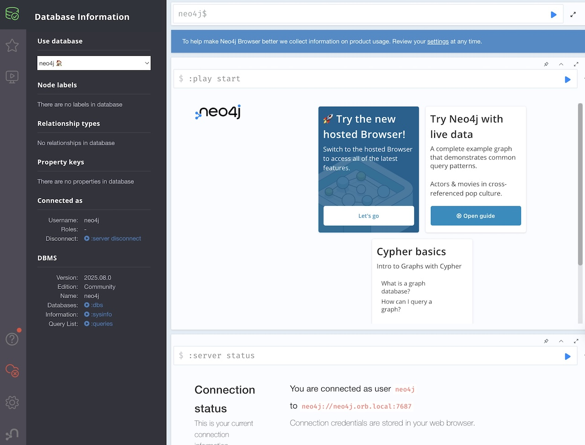
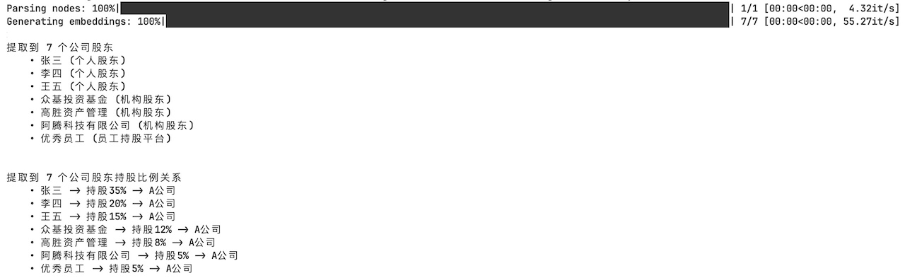
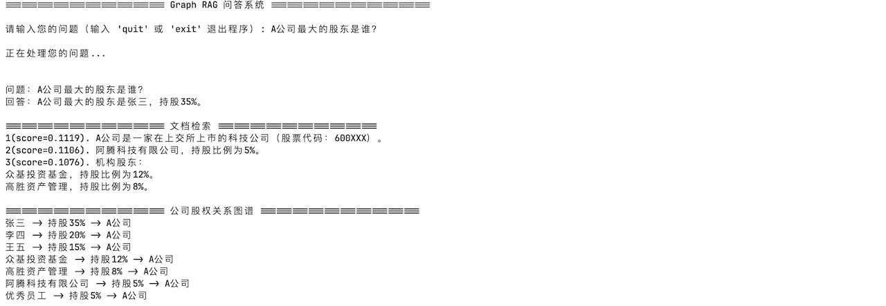

# 第三周作业 Part 2

## 作业二：构建一个融合文档检索、图谱推理的多跳问答系统

- 场景设定
  **用户问：** “A 公司的最大股东是谁？”
- 系统流程
  1. 检索 A 公司相关信息（RAG）
  2. 图谱中查找控股关系（KG）
  3. 生成最终回答（LLM）
- 技术难点
  - 如何将 RAG 与图谱推理融合？
  - 如何设计联合评分机制？
  - 如何防止错误传播？（如图谱中错误关系导致错误回答）
- 工程化要求
  - 使用 Neo4j 构建企业股权图谱
  - 使用 LlamaIndex 实现文档检索
  - 实现多跳查询逻辑（Cypher + LLM 协同）
  - 构建可解释性输出（展示推理路径）

### 1. 使用 docker 部署 Neo4j

> 参考官方文档： [Getting started with Neo4j in Docker](https://neo4j.com/docs/operations-manual/current/docker/introduction/)

```bash
# 替换 your-password 为自己的密码
docker run --name=neo4j  -d \
    --env NEO4J_AUTH=neo4j/your-password \
    --publish=7474:7474 --publish=7687:7687 \
    --volume=neo4j-data:/data \
    --volume=neo4j-logs:/logs \
    neo4j:latest
```

访问：[http://localhost:7474](http://localhost:7474) 并使用 `neo4j`/your-password 登录，成功说明启动成功。


### 2. 核心代码实现

- LlamaIndex 文档检索： [llama_index_rag.py](llama_index_rag.py)
- Neo4j 图谱检索： [neo4j_graph_rag.py](neo4j_graph_rag.py)
- 执行入口： [main.py](main.py)

### 3. 运行示例

> 数据源：[A 公司介绍文档](a-company.txt)



