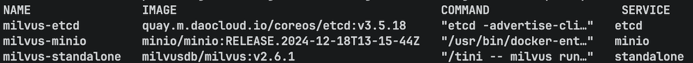
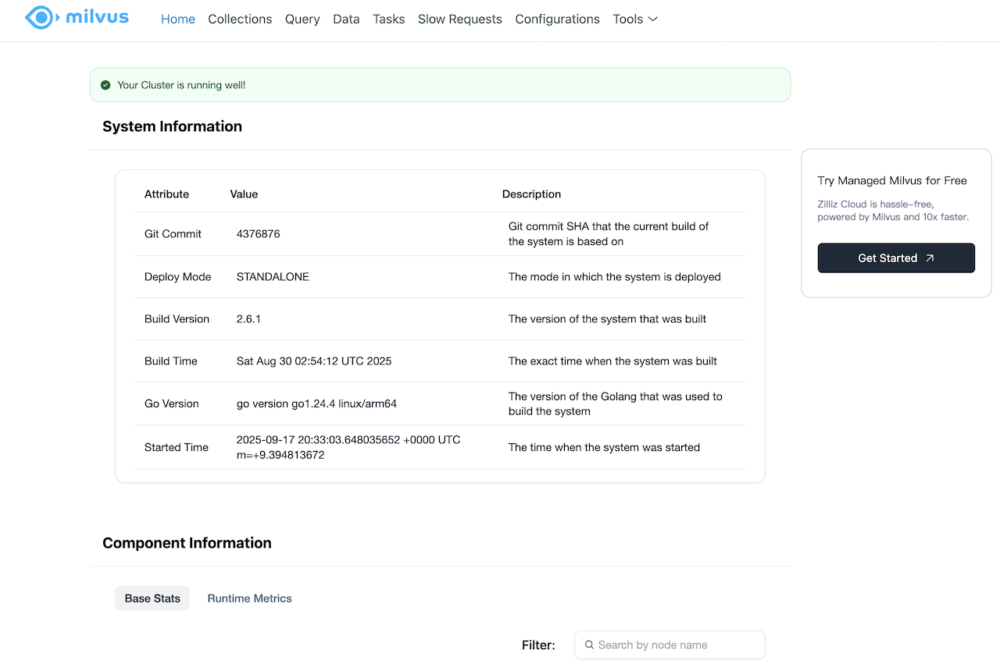
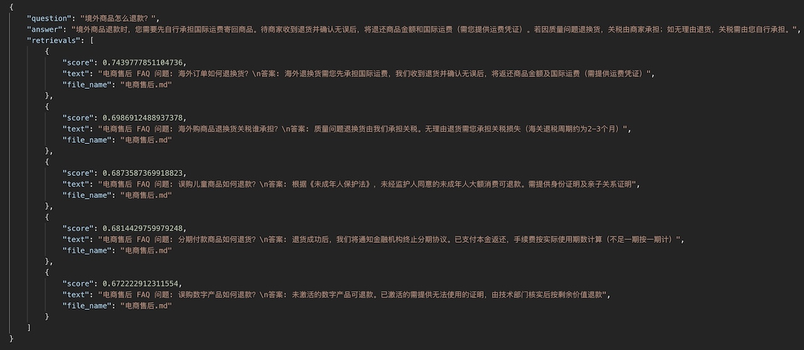
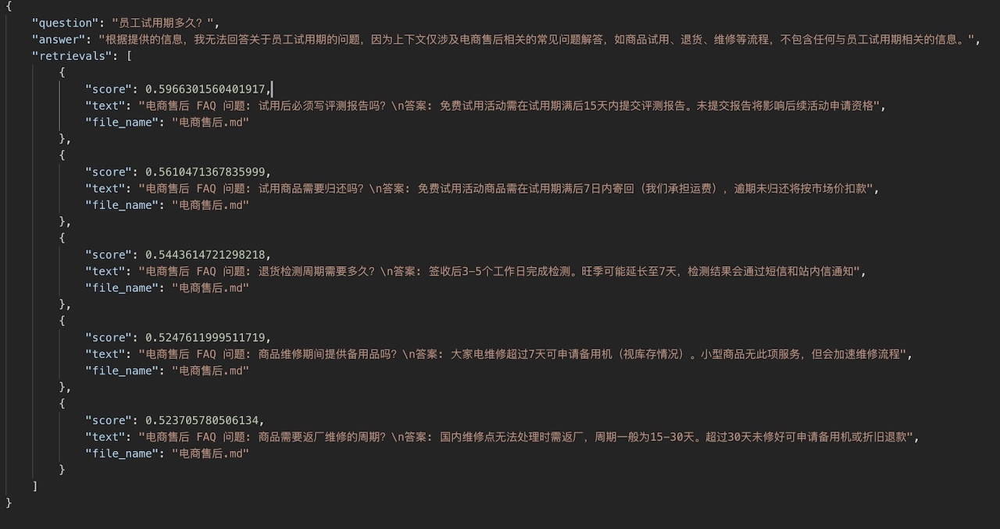
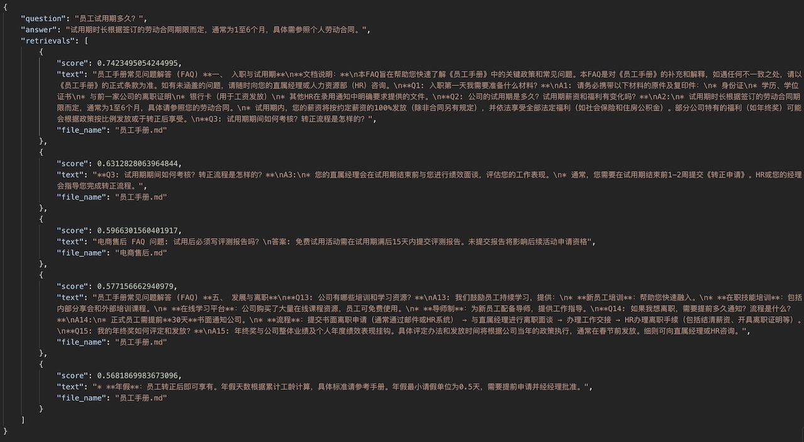

# 第三周作业 Part 2

## 作业一：构建一个基于 Milvus 的 FAQ 检索系统

### 输入输出定义

- **输入：** 用户自然语言问题（如“如何退货？”）
- **输出：** 最相关的 FAQ 条目及其答案

### 扩展项

- 支持热更新知识库（ 自动 re-index）
- 提供 RESTful API 接口（FastAPI 封装）

### 工程化要求

- 使用 LlamaIndex 构建索引
- 部署 Milvus 作为向量库
- 实现文档切片优化（语义切分 + 重叠）

### 部署 Milvus

#### 1. 使用 docker compose 部署 milvus

> 参考官方文档：[使用 Docker Compose 运行 Milvus (Linux)](https://milvus.io/docs/zh/install_standalone-docker-compose.md)
> 当前项目使用：[docker-compose](docker-compose.yml)

```bash
docker compose up -d
```

#### 2. 查看运行情况 `docker compose ps`



#### 3. 访问 webui: `http://127.0.0.1:9091/webui/`



### 核心代码实现

#### RAG 实现： [faq_rag.py](faq_rag.py)

#### FastAPI 封装： [api_router.py](api_router.py)

- /api/ask 接口: 进行 FAQ 提问
- /api/update-by-upload：通过上传文件更新索引

### 效果预览

#### /api/ask 接口

- 请求参数

  ```json
  {
      "question": "境外商品怎么退款？",
      "top_k": 5
  }
  ```

- 请求响应
  

#### /api/update-by-upload 接口

- 请求参数

  ```json
  {
      "question": "员工试用期多久？",
      "top_k": 5
  }
  ```

- 未更新前响应
  
- 更新后请求响应

  > 使用 [员工手册](docs/员工手册.md) 文件上更新知识库
  >

  
