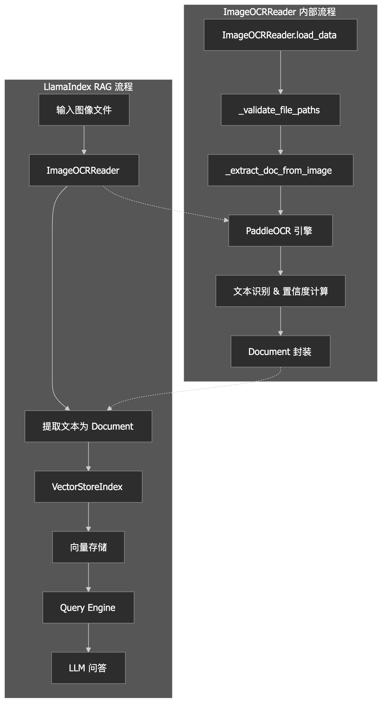
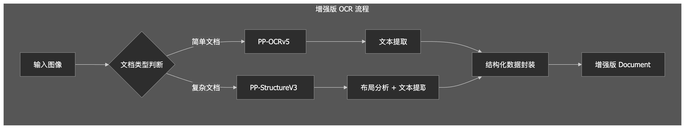

# 作业二: 为 LlamaIndex 构建 OCR 图像文本加载器：基于 paddle-OCR的多模态数据接入

## 架构设计图：展示 ImageOCRReader 在 LlamaIndex 流程中的位置



## 核心代码说明：关键函数与类的设计思路

### 1. 类继承结构

```python
class ImageOCRReader(BaseReader):
```

设计思路：继承 LlamaIndex 的 BaseReader，确保与框架的兼容性
优势：可以直接在 LlamaIndex 的 pipeline 中使用，支持 load_data 标准接口

### 2. 核心方法设计

1. 文件验证方法

   ```python
   def _validate_file_paths(self, file_paths: list[str]) -> list[str]:
   ```

   设计思路：

   * 检查文件存在性、文件类型、格式支持
   * 返回有效路径列表，确保后续处理稳定性
2. 单图像处理核心

   ```python
   def _extract_doc_from_image(self, image_path: str) -> Document | None:
   ```

   设计思路：

   * 异常处理：try-catch 包装整个处理流程
   * 结果验证：检查 OCR 结果是否为空
   * 数据提取：从 OCRResult 中提取文本和置信度
   * 元数据构建：包含丰富的上下文信息
3. 主方法：加载文档，读取数据

   ```python
   @override
   def load_data(self, file: str | list[str]) -> list[Document]:
   ```

   接口设计：

   * 标记重写父类方法 load_data
   * 支持单文件和多文件输入
   * 统一的路径处理逻辑
   * 批量处理并返回 Document 列表

### 3. 元数据字段设计

```python
metadata = {
    "image_path": image_path,
    "ocr_model": self.ocr_info["version"],
    "ocr_lang": self.ocr_info["lang"],
    "ocr_avg_confidence": round(avg_confidence, 4),
    "num_text_blocks": len(all_scores),
}
```

设计思路：

* 可追溯性：记录原始图像路径
* 质量评估：置信度评分帮助后续检索排序
* 统计分析：文本块数量反映内容复杂度
* 模型版本：确保结果可重现

## OCR 效果评估：各类图像的识别准确率（人工评估）

### 运行代码输出结果展示

```
[Document(id_='05c092ea-b19f-4988-8677-e9d65d57f721', embedding=None, metadata={'image_path': 'ocr_research/imgs/1-扫描.jpg', 'ocr_model': 'PP-OCRv5', 'ocr_lang': 'ch', 'ocr_avg_confidence': 0.9755, 'num_text_blocks': 16}, excluded_embed_metadata_keys=[], excluded_llm_metadata_keys=[], relationships={}, metadata_template='{key}: {value}', metadata_separator='\n', text_resource=MediaResource(embeddings=None, data=None, text='人们经常问我，“你的Python开发环境是什么？”我的回答基本永远都是“IPython外加\n一个文本编辑器”。如果想要得到更加高级的图形化工具和代码自动完成功能，你也可\n以考虑用一款集成开发环境（IDE）来代替文本编辑器。即便如此，我仍然强烈建议你\n将IPython作为工作中的重要工具。有的IDE甚至本身就集成了IPython，所以说两全其美\n的办法还是有的。\n2001年，FernandoPerez为了得到一个更为高效的交互式Pvthon解释器而启动了一个业\n余项目，于是IPvthon项目诞生了。在接下来的11年中，它逐渐被公认为现代科学计算中\n最重要的Python工具之一。IPython本身并没有提供任何的计算或数据分析功能，其设计\n目的是在交互式计算和软件开发这两个方面最大化地提高生产力。它鼓励一种“执行一\n探索”（execute explore）的工作模式，而不是许多其他编程语言那种“编辑-编译一\n运行”（edit-complie-run）的传统工作模式。此外，它跟操作系统shell和文件系统之间\n也有着非常紧密的集成，由于大部分的数据分析代码都含有探索式操作（试误法和选代\n法），因此IPython（在绝大多数情况下）将有助于提高你的工作效率。\n当然了，IPython项目现在已经不再只是一个加强版的交互式Pythonshell，它还有一个可\n以直接进行绘图操作的GUI控制台，一个基于Web的交互式笔记本，以及一个轻量级的\n快速井行计算引擎。此外，跟许多其他专为程序员设计（以及由程序员设计）的工具一', path=None, url=None, mimetype=None), image_resource=None, audio_resource=None, video_resource=None, text_template='{metadata_str}\n\n{content}'), Document(id_='6fa4a132-b238-462f-b20b-14a6387a11d7', embedding=None, metadata={'image_path': 'ocr_research/imgs/2-屏幕截图.jpg', 'ocr_model': 'PP-OCRv5', 'ocr_lang': 'ch', 'ocr_avg_confidence': 0.9761, 'num_text_blocks': 9}, excluded_embed_metadata_keys=[], excluded_llm_metadata_keys=[], relationships={}, metadata_template='{key}: {value}', metadata_separator='\n', text_resource=MediaResource(embeddings=None, data=None, text='PaddleOCR自发布以来凭借学术前沿算法和产业落地实践，受到了产学研各方的喜爱，并被广泛应用于众多知名开源项目，例如：Umi-OCR、OmniParser、MinerU、\nRAGFlow等，已成为广大开发者心中的开源OCR领域的首选工具。2025年5月20日，飞桨团队发布PaddleOCR3.0，全面适配飞桨框架3.0正式版，进一步提升文字识别精\n度，支持多文字类型识别和手写体识别，满足大模型应用对复杂文档高精度解析的旺盛需求，结合文心大模型4.5显著提升关键信息抽取精度，并新增对昆仑芯、昇腾等\n国产硬件的支持。\nPaddleOCR3.0新增三大特色能力：\n全场景文字识别模型PP-OCRv5：单模型支持五种文字类型和复杂手写体识别；整体识别精度相比上一代提升13个百分点。在线体验\n置通用文档解析方案PP-StructureV3：支持多场景、多版式PDF高精度解析，在公开评测集中领先众多开源和闭源方案。在线体验\n√智能文档理解方案PP-ChatOCRv4：原生支持文心大模型4.5，精度相比上一代提升15个百分点。在线体验\nPaddleOCR3.0除了提供优秀的模型库外，还提供好学易用的工具，覆盖模型训练、推理和服务化部署，方便开发者快速落地AI应用。', path=None, url=None, mimetype=None), image_resource=None, audio_resource=None, video_resource=None, text_template='{metadata_str}\n\n{content}'), Document(id_='541035c2-409c-45d0-9ed7-8f6d930f80ae', embedding=None, metadata={'image_path': 'ocr_research/imgs/3-路牌.jpg', 'ocr_model': 'PP-OCRv5', 'ocr_lang': 'ch', 'ocr_avg_confidence': 0.9767, 'num_text_blocks': 7}, excluded_embed_metadata_keys=[], excluded_llm_metadata_keys=[], relationships={}, metadata_template='{key}: {value}', metadata_separator='\n', text_resource=MediaResource(embeddings=None, data=None, text='陶赖昭\n16\nkm\n长春118\nkm\n沈阳\n412km', path=None, url=None, mimetype=None), image_resource=None, audio_resource=None, video_resource=None, text_template='{metadata_str}\n\n{content}')]

=================对 1-扫描.jpg 提问=================
查询: IPython 诞生于哪一年？它鼓励什么工作模式？
回答: IPython 诞生于 2001 年。它鼓励一种“执行一探索”（execute-explore）的工作模式。


=================对 2-屏幕截图.jpg 提问=================
查询: PaddleOCR 3.0新增哪些特色能力？
回答: PaddleOCR 3.0新增了三大特色能力：

1. 全场景文字识别模型PP-OCRv5：该模型支持五种文字类型和复杂手写体识别，整体识别精度相比上一代提升13个百分点。

2. 通用文档解析方案PP-StructureV3：支持多场景、多版式PDF的高精度解析，并在公开评测集中领先众多开源和闭源方案。

3. 智能文档理解方案PP-ChatOCRv4：原生支持文心大模型4.5，精度相比上一代提升15个百分点。


=================对 3-路牌 提问=================
查询: 离长春还有多远？
回答: 离长春还有118公里。
```

### OCR 效果评估分析

| 图像类型       | 文本块数 | 平均置信度 | 人工评估准确率 | 主要优点                                 | 存在问题                                 |
| -------------- | -------- | ---------- | -------------- | ---------------------------------------- | ---------------------------------------- |
| 1-扫描.jpg     | 16       | 97.55%     | 95%            | 技术术语准确，段落结构保持完整           | 英文单词间缺少空格，标点符号识别有小误差 |
| 2-屏幕截图.jpg | 9        | 97.61%     | 98%            | 技术术语完美，数字精度高，标点符号正确   | 个别换行位置不够理想                     |
| 3-路牌.jpg     | 7        | 97.67%     | 100%           | 地名和距离数字完全准确，空间布局保持完好 | 无识别错误                               |

## 错误案例分析（如倾斜、模糊、艺术字体）

### 代码运行结果展示

```
[Document(id_='bc5b9eef-73b0-462c-be5e-39a69e14faa8', embedding=None, metadata={'image_path': 'ocr_research/imgs/4-模糊文字.png', 'ocr_model': 'PP-OCRv5', 'ocr_lang': 'ch', 'ocr_avg_confidence': 0.8697, 'num_text_blocks': 23}, excluded_embed_metadata_keys=[], excluded_llm_metadata_keys=[], relationships={}, metadata_template='{key}: {value}', metadata_separator='\n', text_resource=MediaResource(embeddings=None, data=None, text='PaddleOCR\n与\nPaddleX 的区别与联系\nPaddeOcR\nPaddex\n在定位和功能上各有侧重：PaddleOCR专注于OCR相关任务，而\nE\nPaddleX\n则覆盖了包括时序预测、人脸识别等在内的多种任务类型。此外，PaddeX提供了丰富的\n基础设施，具备多模型组合推理的底层能力，能够以统一且灵活的方式接入不同模型，支持构建复\n杂的模型产线。\nPaddleOCR在推理部署环节充分复用了PaddleX的能力，具体包括：\nPaddleOCR在模型推理、前后处理及多模型组合等底层能力上，主要依赖于PaddleX。\nPaddleOCR的高性能推理能力通过PaddleX的Paddle2ONNX插件及高性能推理括件实现。\nPaddleOCR的服务化部署方案基于PaddleX的实现。\n需要特别说明的是\n尽管PaddleOCR在底层使用了PaddleX，但得益于PaddleX的可选依赖安装\n动能\n安装PaddleOCR推理包时井不会安装PaddleX的全部依赖，而只会安装OCR类任务需要\n使用到的依赖\n用户通常无需关心依赖体积的过度膨胀问题。2025年5月测试。\n在x86-64+\nLinux+Python3.10环境中，需要安装的依赖总体积仅仅从717MB增加到738MB。', path=None, url=None, mimetype=None), image_resource=None, audio_resource=None, video_resource=None, text_template='{metadata_str}\n\n{content}')]

=================对 4-模糊文字.png 提问=================
查询: PaddleOCR 与 PaddleX 的区别与联系
回答: PaddleOCR 和 PaddleX 在定位和功能上各有侧重。PaddleOCR 专注于 OCR 相关任务，而 PaddleX 覆盖了包括时序预测、人脸识别等在内的多种任务类型。此外，PaddleX 提供了丰富的基础设施，具备多模型组合推理的底层能力，能够以统一且灵活的方式接入不同模型，支持构建复杂的模型产线。

在推理部署环节，PaddleOCR 充分复用了 PaddleX 的能力。具体来说，PaddleOCR 在模型推理、前后处理及多模型组合等底层能力上，主要依赖于 PaddleX。其高性能推理能力通过 PaddleX 的 Paddle2ONNX 插件及高性能推理组件实现，服务化部署方案也基于 PaddleX 的实现。

尽管 PaddleOCR 在底层使用了 PaddleX，但得益于 PaddleX 的可选依赖安装机制，安装 PaddleOCR 推理包时并不会安装 PaddleX 的全部依赖，而只会安装 OCR 类任务需要用到的依赖。因此，用户通常无需关心依赖体积的过度膨胀问题。测试显示，在 x86-64 Linux + Python3.10 环境中，安装 PaddleOCR 后依赖总体积仅从 717MB 增加到 738MB。

[Document(id_='246b6e8e-cf05-432d-ae77-b347dd19ba0c', embedding=None, metadata={'image_path': 'ocr_research/imgs/6-艺术文字.png', 'ocr_model': 'PP-OCRv5', 'ocr_lang': 'ch', 'ocr_avg_confidence': 0.8892, 'num_text_blocks': 20}, excluded_embed_metadata_keys=[], excluded_llm_metadata_keys=[], relationships={}, metadata_template='{key}: {value}', metadata_separator='\n', text_resource=MediaResource(embeddings=None, data=None, text='本文档主要介绍如何配置PaddleOCB推理包的日志系\n统。需要注意的是，PaddleOCB推理包与训练脚本使用\n的是不同的日志系统，本文档不涉及训练脚本所使用的日\n志系统的配置方法。\nPaddleOCB构建了一个基于Pχthonlogging标准库的集中\n式日志系统。换言之，\n,\nPaddleOCB使用唯一的日志记录\nY\n器（łogger），可通过paddleocr.logger访问和配置。\n默认情况下，PaddlεOCB的志级别设为EBBOB，这意\n味着仅当日志级别为EBBOB或更高（如CBITICAL）时，\n日志信息才会输出。PaddleOCB同时为该日志记录器配\n置了一个StreamHandler，将日志输出到标准错误流，并\n将记录器的propagate属性设为False，以避免日志信息\n传递到其父记录器。\n若希望禁止PaddlｅOＣB对日志系统的自动配置行为，可\n将环境变量RISABLE_AUTO_LOGGING_CONFIG设为1。\n此时，PaddlOCB将不会对日志记录器进行任何额外配\n置。', path=None, url=None, mimetype=None), image_resource=None, audio_resource=None, video_resource=None, text_template='{metadata_str}\n\n{content}')]

=================对 6-艺术文字.png 提问=================
查询: 默认情况下，PaddleOCR 的日志级别是什么？
回答: 默认情况下，PaddleOCR 的日志级别设为 EBBOB。
```

### 效果评估

| 图像类型       | 文本块数 | 平均置信度 | 人工评估准确率 | 存在问题                                   |
| -------------- | -------- | ---------- | -------------- | ---------------------------------------- |
| 4-模糊文字.png | 23 | 86.97% | 85% | 模糊导致字符变形，产品名称拼写错误 |
| 5-艺术文字.jpg     | 0        | 0   | 0         | 无法识别，程序直接退出                                 |
| 6-艺术文字.png | 20       | 88.92%     | 65%            | 艺术字体导致严重字符混淆，技术术语错误率高 |

## Document 封装合理性讨论：文本拼接方式是否合理？元数据设计是否有助于后续检索？

### 文本拼接方式评估

当前实现：

```python
full_text = "\n".join(text_lines)
```

**合理性分析：**

**优点**：

* 简单有效：使用换行符拼接是最直接的文本组织方式
* 保持可读性：换行符保持了文本的自然段落结构
* 兼容性好：纯文本格式被所有LLM和检索系统支持

**局限性：**

* 空间信息丢失：无法保留文本在图像中的相对位置信息
* 表格结构破坏：表格内容会被线性化，失去行列关系
* 布局语义缺失：标题、正文、注释等视觉层次信息丢失

### 元数据设计评估

当前元数据字段：

```json
{
    "image_path": image_path,
    "ocr_model": self.ocr_info["version"],
    "ocr_lang": self.ocr_info["lang"],
    "ocr_avg_confidence": round(avg_confidence, 4),
    "num_text_blocks": len(all_scores),
}
```

**合理性分析：**

* 置信度过滤：ocr_avg_confidence 可用于筛选高质量文本片段
* 来源追溯：image_path 支持基于图像源的检索和验证
* 质量排序：置信度和文本块数可作为检索结果排序依据
* 多语言支持：ocr_lang 字段支持多语言文档的混合检索和语言特定处理
* ocr_model 确保结果可重现和模型升级的兼容性

## 局限性与改进建议：如何保留空间结构（如表格）？是否可加入 layout analysis（如 PP-Structure）？

### 当前局限性

* 空间结构丢失：表格、多栏文档等复杂布局被线性化
* 视觉层次缺失：标题、正文、注释等语义信息丢失
* 非文本内容忽略：图片、图表等非文本内容无法处理

### PP-Structure 集成方案


