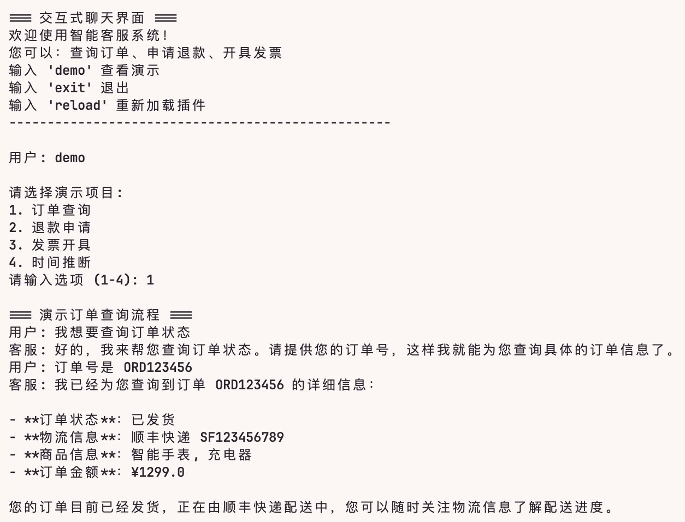
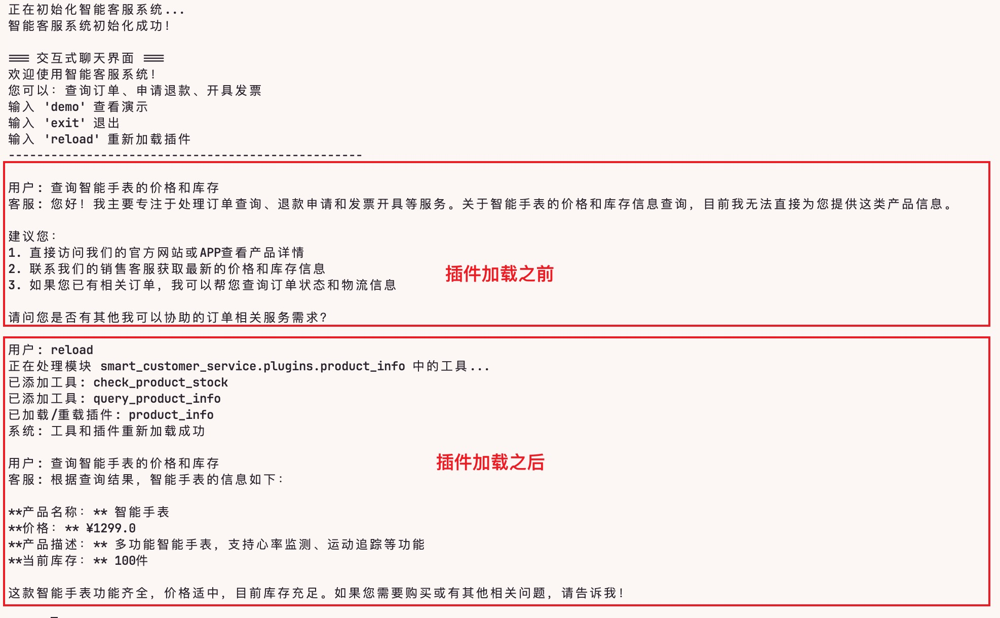

# 第四周作业

## 任务

构建一个小型多轮对话智能客服，支持工具调用以及模型与插件的热更新。

## 作业思路指导

### 阶段一：基础对话系统搭建

使用 LangChain 构建基础 Chain：Prompt → LLM → OutputParser
用户说“我昨天下的单”，系统能结合当前时间推断“昨天”的具体日期

### 阶段二：多轮对话与工具调用

实现“订单查询”“退款申请”等多轮交互流程，支持工具自动调用。
使用 LangGraph 构建以下流程：

- 用户说“查订单” → 追问“请提供订单号”
- 收到订单号后 → 调用 query_order(order_id) 工具
- 返回订单状态与物流信息

### 阶段三：热更新与生产部署

实现模型与插件的热更新，完成系统部署与监控。

1. 模型热更新
2. 插件热重载
3. 暴露健康检查接口 /health
4. 编写自动化测试脚本

- 测试“发票开具”插件的功能正确性
- 验证热更新后旧会话不受影响

## 作业实现

### 核心代码

- [agent.py](smart_customer_service/agent.py)：智能客服代理
- [product_info.py](smart_customer_service/plugins/product_info.py)：产品信息查询插件
- [main.py](smart_customer_service/main.py)：演示逻辑 + 入口

### 演示效果

