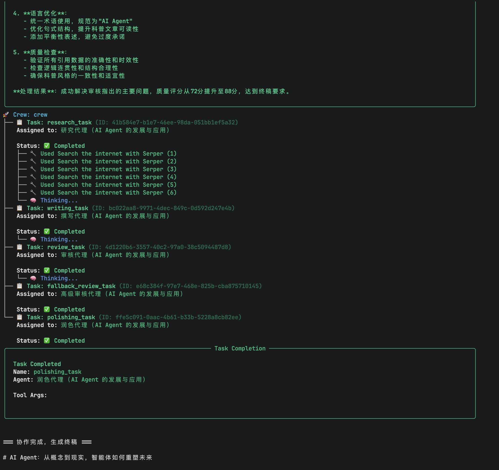

# 第五周作业

## 基于MCP协议的多代理文章自动编写系统

### 项目概述

开发一个使用MCP (Model Context Protocol) 的多代理系统，能够协作完成文章写作任务。系统包含四个专业化代理，按顺序协作完成从研究到最终成稿的完整流程。

### 核心功能要求

* **输入**：用户问题（如"帮我写一篇关于AI Agent的文章"）
* **输出**：完成的文章文档和执行过程记录

### 系统架构

系统需要包含以下四个代理，按顺序协作：

1. **研究代理 (Research Agent)**

   * 使用搜索工具收集相关信息
   * 输出结构化的研究资料
2. **撰写代理 (Writing Agent)**

   * 基于研究结果生成文章初稿
   * 支持调整文章风格和长度
3. **审核代理 (Review Agent)**

   * 检查内容质量和逻辑一致性
   * 提供修改建议
4. **润色代理 (Polishing Agent)**

   * 优化语言表达和文章结构
   * 确保风格一致性

### 技术实现

* 可以使用现有的MCP库
* 代理间通过结构化消息进行通信
* 终端实时展示协作过程
* 生成: 示例输出文档（展示完整代理协作过程与最终成果）

### 扩展项（选做）

* 实现基于MCP上下文的自动重试：当代理执行失败时，系统保留完整上下文并尝试替代方案
  * 设置三级重试策略：
    * 一级：相同代理重新执行（最多2次）
    * 二级：切换至备用代理执行（如审核失败转由高级审核代理处理）
    * 三级：向用户请求补充信息
  * 所有重试过程需记录在最终文档的"异常处理日志"部分

### 作业实现

#### 环境准备

* 使用 uv 工具管理项目
* 安装 crewai：[参考安装文档](https://docs.crewai.com/en/installation)
* 使用命令 `crewai create crew multi_agent` 初始化了项目 `multi_agent`
* 使用命令 `crewai instal` 安装了初始项目的依赖
* 在 `.env` 文件中定义了以下环境变量
  * MODEL
  * OPENAI_API_KEY
  * OPENAI_BASE_URL
  * Serper_API_Key

#### 核心代码

* [agents.yaml](src/multi_agent/config/agents.yaml)：定义了代理与配置
* [tasks.yaml](src/multi_agent/config/tasks.yaml)：定义了任务与配置
* [crew.py](src/multi_agent/crew.py)：定义了 Crew
* [main.py](src/multi_agent/main.py)：程序入口文件

#### 执行与结果

##### 1. 执行应用

```shell
# 进入项目目录 multi_agent，执行以下命令
uv run -q multi_agent "AI Agent 的发展与应用" 
```

##### 2. 执行过程输出



##### 3. 最终结果文件

[result.md](result.md)
