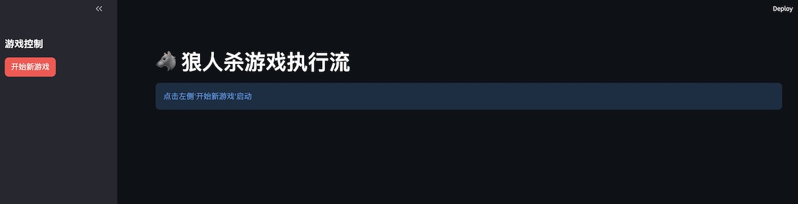
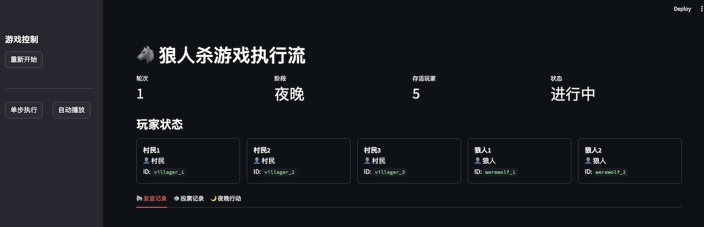
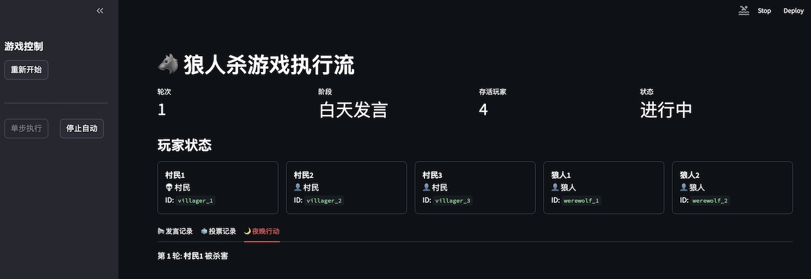
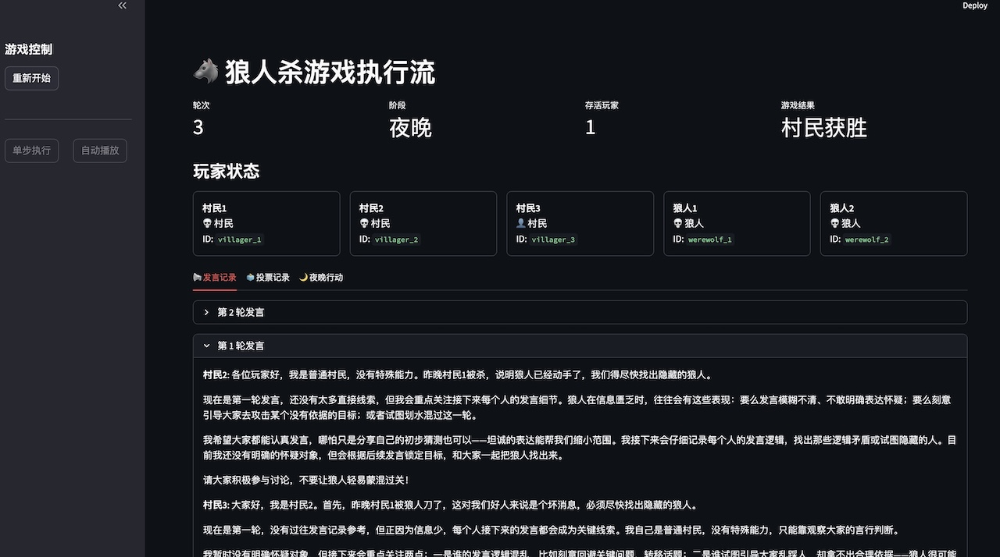
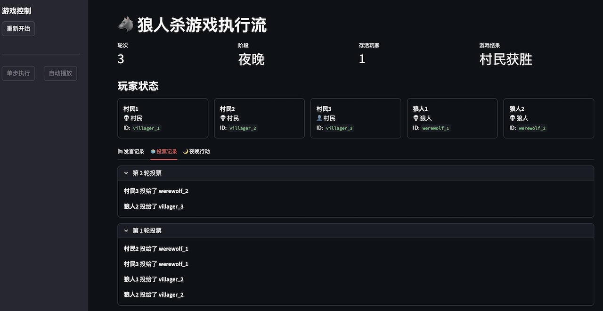
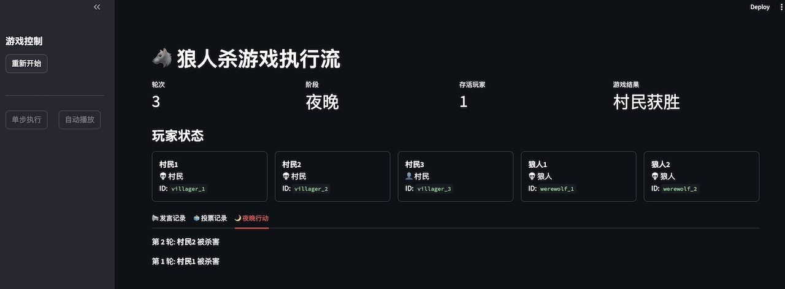

# 第十一周作业

《基于智能体协作的狼人杀游戏系统开发》作业报告

## 1. 简要设计说明

### 1.1 架构选择

本项目采用 **Multi-Agent（多智能体）** 架构，基于 **LangChain** 框架构建。核心设计思想是将每个游戏角色（村民、狼人、主持人）建模为独立的智能体，通过 **Memory（记忆）** 和 **Planning（规划）** 机制实现自主决策。

* **Agent 抽象**: 定义了 `BaseAgent` 基类，封装了 LLM 调用、记忆检索、发言和投票等通用能力。
* **角色特化**: `VillagerAgent` 和 `WerewolfAgent` 继承自基类，分别实现了不同的 Prompt 策略和行为逻辑（如狼人的伪装、夜间杀人）。
* **流程控制**: `ModeratorAgent` 作为主持人，负责维护游戏状态、判定胜负、推进阶段（夜晚 -> 白天 -> 投票）。
* **执行流**: `GameFlow` 类管理整体游戏循环，支持 **CLI 自动运行** 和 **Streamlit 单步执行** 两种模式。

### 1.2 项目结构

```text
werewolf/
├── agents/             # 智能体实现
│   ├── base_agent.py   # Agent基类：封装LLM调用、记忆管理等通用功能
│   ├── villager.py     # 村民Agent：实现普通村民的行为逻辑
│   ├── werewolf.py     # 狼人Agent：实现狼人夜间杀人、伪装发言等逻辑
│   ├── moderator.py    # 主持人Agent：负责游戏流程控制和规则判定
│   ├── seer.py         # 预言家Agent：实现夜间查验身份逻辑
│   ├── witch.py        # 女巫Agent：实现解药和毒药的使用逻辑
│   └── hunter.py       # 猎人Agent：实现死亡开枪带人逻辑
├── game/               # 游戏核心逻辑
│   ├── game_flow.py    # 游戏流程控制：管理游戏循环和阶段切换
│   ├── game_state.py   # 游戏状态定义：定义GameState数据结构
│   └── rules.py        # 游戏规则定义：胜负判定等核心规则
├── memory/             # 记忆模块
│   ├── memory_manager.py # 记忆管理器：统一管理嵌入生成和存储检索
│   └── milvus_store.py   # Milvus存储实现：封装Milvus数据库操作
├── prompts/            # Prompt模板
│   ├── villager_prompts.py  # 村民相关Prompt
│   ├── werewolf_prompts.py  # 狼人相关Prompt
│   ├── seer_prompts.py      # 预言家相关Prompt
│   ├── witch_prompts.py     # 女巫相关Prompt
│   └── hunter_prompts.py    # 猎人相关Prompt
├── visualization/      # 可视化模块
│   └── streamlit_app.py # Streamlit Web界面：提供交互式游戏控制和展示
├── utils/              # 工具模块
│   ├── config.py       # 配置管理：加载环境变量和全局配置
│   ├── logger.py       # 日志系统：统一日志格式和输出
│   └── retry.py        # 重试机制：处理API调用失败等情况
└── main.py             # CLI启动入口：命令行模式运行游戏
```

### 1.3 RAG 应用方式

本项目使用 **RAG (Retrieval-Augmented Generation)** 技术增强 Agent 的长期记忆和推理能力：

1. **存储 (Storage)**: Agent 的每一次观察（如有人死亡）、发言（自己和他人的发言）和行为都会被封装成文本，通过 `SentenceTransformer` (BGE-M3) 转化为向量，存储在 **Milvus** 向量数据库中。
2. **检索 (Retrieval)**: 在 Agent 需要发言或投票时，系统会根据当前上下文（如"找出狼人"）生成查询向量，从 Milvus 中检索最相关的历史记忆（Top-K）。
3. **增强 (Augmentation)**: 检索到的记忆被注入到 Prompt 中，作为上下文提供给 LLM，使其决策能够基于过往的游戏进程，而不是仅依赖短期上下文。

### 1.4 调试方法

* **日志系统**: 使用 `logging` 模块记录详细的运行日志（`logs/werewolf.log`），包含每个 Agent 的思考过程、API 调用和游戏状态变化。
* **可视化调试**: 开发了 Streamlit 界面，支持 **单步执行 (Step-by-Step)**。开发者可以暂停游戏，查看每一轮的详细状态（存活列表、发言记录、投票详情），便于定位逻辑错误。

### 1.5 技术栈

* **核心框架**: [LangChain](https://python.langchain.com/) - 用于构建 Multi-Agent 系统和管理 LLM 调用。
* **大语言模型**: OpenAI API 兼容模型 (如 GPT-4, DeepSeek 等) - 提供智能体的推理和生成能力。
* **向量数据库**: [Milvus](https://milvus.io/) - 用于存储和检索 Agent 的长期记忆 (RAG)。
* **Embedding**: HuggingFace (BAAI/bge-m3) - 用于将文本转化为向量。
* **Web 框架**: [Streamlit](https://streamlit.io/) - 用于快速构建交互式可视化界面。
* **依赖管理**: [uv](https://github.com/astral-sh/uv) - 高性能的 Python 包和项目管理器。
* **容器化**: Docker & Docker Compose - 用于部署 Milvus 服务。

## 2. 环境准备与运行

### 1. 安装依赖

终端进入 `week11-homework` 目录，执行以下命令安装依赖：

```bash
uv sync --locked
```

### 2. 启动 Milvus 向量数据库

终端进入 `week11-homework` 目录，执行以下命令启动 Milvus 向量数据库：

```bash
docker compose up -d
```

### 3. 配置环境变量

在 `week11-homework` 目录下的 .env 文件中包含了必要的环境变量，包括：

* `MODEL`：OpenAI 模型（或兼容 OpenAI 模型）名称
* `OPENAI_API_KEY`：OpenAI API（或兼容 OpenAI API）密钥
* `OPENAI_BASE_URL`：OpenAI API（或兼容 OpenAI API）基础 URL
* `EMBEDDING_MODEL`：HuggingFaceEmbeddings（或兼容 HuggingFaceEmbeddings）嵌入模型名称
* `MILVUS_URI`：Milvus 服务器 URI

### 4. 运行游戏

终端进入 `week11-homework` 目录，执行以下命令运行游戏：

* 命令行显示方式：

```bash
uv run -m werewolf.main
```

* Streamlit 可视化方式（web 界面）：

```bash
streamlit run werewolf/visualization/streamlit_app.py
```

## 3. 游戏日志样本（完整一局回放）

以下是一次完整的 5 人局（3 村民 vs 2 狼人）游戏日志：

```text
werewolf.memory - INFO - 成功加载集合: werewolf_memory
werewolf.memory - INFO - 初始化HuggingFaceEmbeddings成功
werewolf.agent - INFO - 成功创建Agent: 村民1 (ID: villager_1, 角色: 村民)
werewolf.agent - INFO - 成功创建Agent: 村民2 (ID: villager_2, 角色: 村民)
werewolf.agent - INFO - 成功创建Agent: 村民3 (ID: villager_3, 角色: 村民)
werewolf.agent - INFO - 成功创建Agent: 狼人1 (ID: werewolf_1, 角色: 狼人)
werewolf.agent - INFO - 成功创建Agent: 狼人2 (ID: werewolf_2, 角色: 狼人)
werewolf.agent - INFO - 成功创建Agent: 主持人 (ID: moderator, 角色: 主持人)
werewolf.game - INFO - 游戏初始化完成
werewolf.game - INFO - 参与玩家: 村民1 (ID: villager_1, 角色: 村民), 村民2 (ID: villager_2, 角色: 村民), 村民3 (ID: villager_3, 角色: 村民), 狼人1 (ID: werewolf_1, 角色: 狼人), 狼人2 (ID: werewolf_2, 角色: 狼人)
werewolf.game - INFO - 第 1 轮夜晚开始
werewolf.agent - INFO - 狼人 狼人1 (ID: werewolf_1) 在第 1 轮夜晚选择杀害 villager_1
werewolf.agent - INFO - 狼人 狼人2 (ID: werewolf_2) 在第 1 轮夜晚选择杀害 villager_1
werewolf.agent - INFO - Agent 村民1 (ID: villager_1) 已死亡
werewolf.game - INFO - 第 1 轮夜晚，村民1 (ID: villager_1) 被狼人杀害
werewolf.game - INFO - 第 1 轮白天发言开始
werewolf.agent - INFO - 村民 村民2 (ID: villager_2) 在第 1 轮发言: 各位玩家好，我是普通村民，没有特殊能力。昨晚村民1被杀，说明狼人已经动手了，我们得尽快找出隐藏的狼人...
werewolf.agent - INFO - 村民 村民3 (ID: villager_3) 在第 1 轮发言: 大家好，我是村民2。首先，昨晚村民1被狼人刀了，这对我们好人来说是个坏消息，必须尽快找出隐藏的狼人。...
werewolf.agent - INFO - 狼人 狼人1 (ID: werewolf_1) 在第 1 轮发言: 唉，昨晚村民1突然遇害，真的让人心里发紧啊——狼人就藏在我们中间，这日子可太不安稳了。  

第一轮...
werewolf.agent - INFO - 狼人 狼人2 (ID: werewolf_2) 在第 1 轮发言: 昨晚村民1突然遇害，真的让人心里发慌啊，咱们村得赶紧找出狼人，不然今晚指不定谁又要遭殃了。  

我...
werewolf.game - INFO - 第 1 轮投票开始
werewolf.agent - INFO - 村民 村民2 (ID: villager_2) 在第 1 轮投票给了 werewolf_1
werewolf.agent - INFO - 村民 村民3 (ID: villager_3) 在第 1 轮投票给了 werewolf_1
werewolf.agent - INFO - 狼人 狼人1 (ID: werewolf_1) 在第 1 轮投票给了 villager_2
werewolf.agent - INFO - 狼人 狼人2 (ID: werewolf_2) 在第 1 轮投票给了 villager_2
werewolf.agent - INFO - Agent 狼人1 (ID: werewolf_1) 已死亡
werewolf.game - INFO - 第 1 轮投票，狼人1 (ID: werewolf_1) 被处决，得票数: 2
werewolf.game - INFO - 第 2 轮夜晚开始
werewolf.agent - INFO - 狼人 狼人2 (ID: werewolf_2) 在第 2 轮夜晚选择杀害 villager_2
werewolf.agent - INFO - Agent 村民2 (ID: villager_2) 已死亡
werewolf.game - INFO - 第 2 轮夜晚，村民2 (ID: villager_2) 被狼人杀害
werewolf.game - INFO - 第 2 轮白天发言开始
werewolf.agent - INFO - 村民 村民3 (ID: villager_3) 在第 2 轮发言: 大家好，我是村民3。先梳理下当前情况：狼人1已被淘汰，但他上一轮无理由怀疑村民2——而村民2是好人，...
werewolf.agent - INFO - 狼人 狼人2 (ID: werewolf_2) 在第 2 轮发言: 现在村里就剩我们两个存活的人了，情况真的太危急了——昨晚村民2也遇害了，再找不出狼人，今晚恐怕就没人...
werewolf.game - INFO - 第 2 轮投票开始
werewolf.agent - INFO - 村民 村民3 (ID: villager_3) 在第 2 轮投票给了 werewolf_2
werewolf.agent - INFO - 狼人 狼人2 (ID: werewolf_2) 在第 2 轮投票给了 villager_3
werewolf.agent - INFO - Agent 狼人2 (ID: werewolf_2) 已死亡
werewolf.game - INFO - 第 2 轮投票，狼人2 (ID: werewolf_2) 被处决，得票数: 1
werewolf.game - INFO - 村民获胜！所有狼人已被消灭。
```

---

## 4. 本地可视化界面原型

基于 Streamlit 开发了交互式可视化界面，支持游戏状态的实时监控和控制。

### 4.1 游戏初始化与控制

界面左侧提供了游戏控制面板，支持 **开始新游戏**、**单步执行** 和 **自动播放**。


### 4.2 自动播放模式

点击"自动播放"后，游戏将自动推进，适合快速查看对局结果。


### 4.3 实时状态监控

界面顶部实时显示当前轮次、阶段、存活/死亡人数。中间区域以卡片形式展示所有玩家的存活状态和角色（上帝视角）。


### 4.4 详细记录追踪

底部提供了三个标签页，分别展示详细的游戏记录：

**发言记录**：查看每一轮每个 Agent 的完整发言内容。


**投票记录**：查看每一轮的投票详情和票型统计。


**夜晚行动**：追踪夜晚发生的暗杀事件。

